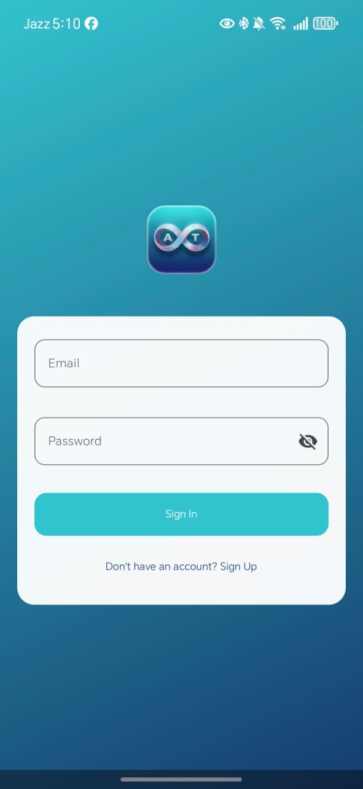
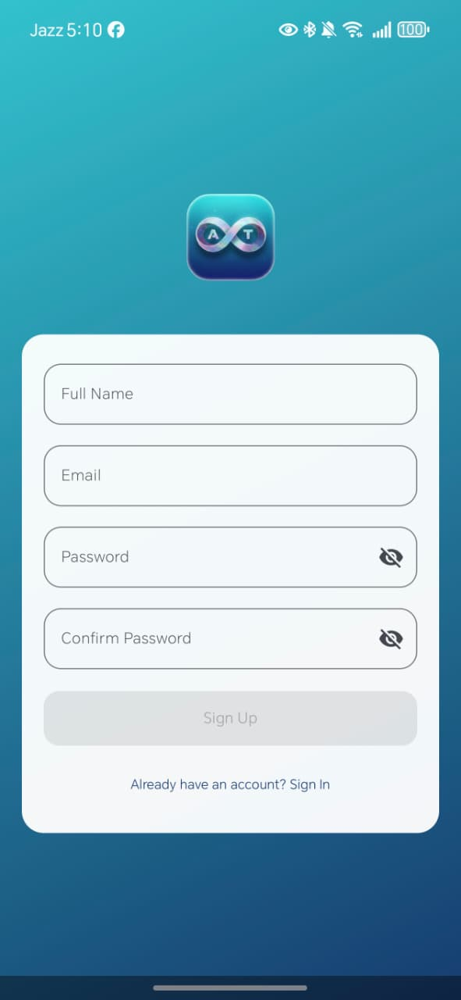
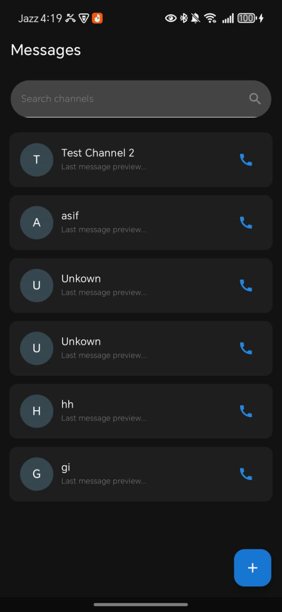
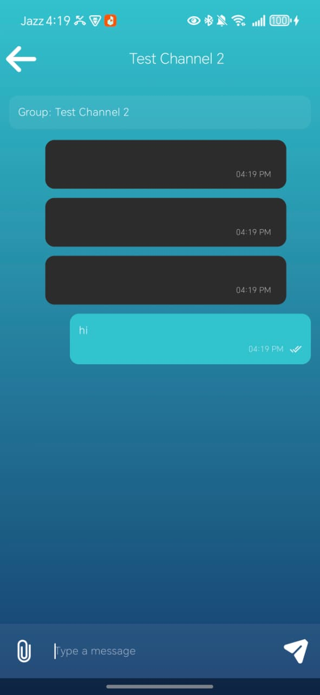

# 💬 AeroTalk-Chat-Messanger-App (Created By : Talha Shafique)
AeroTalk Chat Messanger App

## 💬 Description AeroTalk Chat Messanger App
The **AeroTalk** is a modern chat messenger designed for instant communication, media sharing, and high-quality voice and video calls. Built for casual and professional users, AeroTalk delivers real-time messaging, call notifications, and presence updates, ensuring you never miss a message or a call. Integrated **ZegoCloud Services** make audio and video calling effortless, while **Firebase and Supabase** ensure reliable real-time data and secure authentication. AeroTalk keeps all chat history, media, and call logs in one place, making messaging faster, smarter, and more enjoyable. The application follows the robust **MVVM (Model–View–ViewModel) architectural pattern**. In this structure, the **Composable Screens (Views)** are designed to flawlessly display data state managed by the ViewModels. The project includes essential **Data Model Classes (e.g., Channel, Message)** to formally define the application's data structure and incorporates a streamlined Compose Navigation system to ensure a smooth, intuitive user journey through all the screens.

## ⚙️ Technologies Used
- 💻 **Language:** Kotlin
- 🎨 **UI Framework:** Jetpack Compose (Material 3)
- 🧩 **Architecture:** MVVM (Model–View–ViewModel) + Clean Architecture
- 🌐 **Networking:** Volley
- 🧭 **Navigation:** Compose Navigation
- 🧠 **Dependency Injection:** Hilt
- 🖼️ **Image Loading:** Coil
- 🧠 **State Management:** Compose State and Flow
- 🔐 **Realtime & Backend:** Firebase Realtime Database + Supabase
- 🎙️ **Audio/Video Calling:** ZegoCloud Services

## 💬 App Screenshots
| **1. Login Screen** | **2. Signup Screen** | **3. ChatHome Screen** | **4. ChatSendMessage Screen** |
| :---: | :---: | :---: | :---: |
|  |  |  |
|  |
